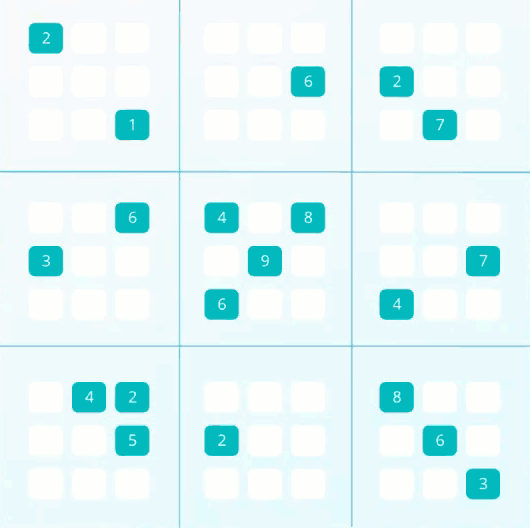
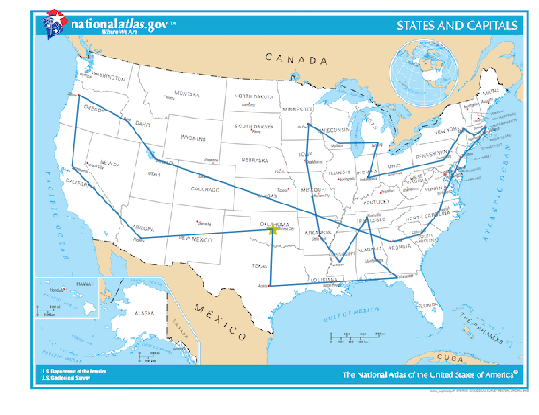

# Artificial Intelligence Nanodegree by Udacity
Solutions to the Nanodegree's projects.

## Project 01: Sudoku Solver
Using constraint propagation and depth first search.

## Project 02: Isolation Game Agent
Using the minimax algorithm with alpha-beta pruning.

## Lab 01: Teaching Pac-Man
Using 'Breadth First Search', 'Uniform Cost Search' and 'A* Search'.

## Lab 02: Travelling Salesmen
Using 'Simulated Annealing' to approximate a solution.

