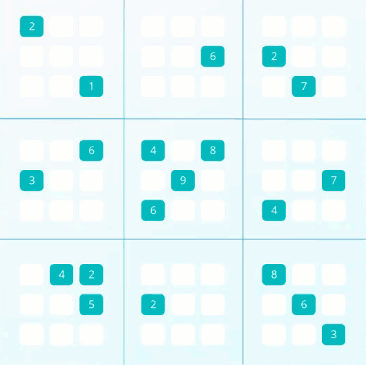
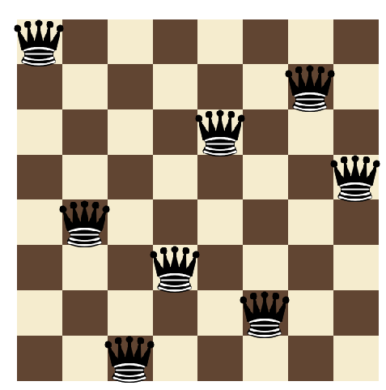
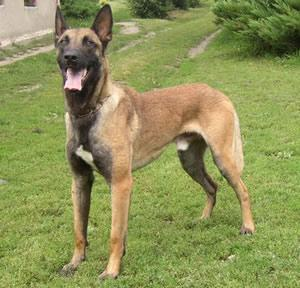
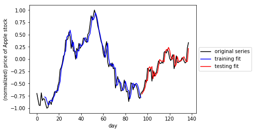

# Artificial Intelligence Nanodegree by Udacity
Solutions to the Nanodegree's projects.

## Foundations Of AI

### Sudoku Solver
Using constraint propagation and depth first search.

### Isolation Game Agent
Using the minimax algorithm with alpha-beta pruning.

### Teaching Pac-Man
Using 'Breadth First Search', 'Uniform Cost Search' and 'A* Search'.

### Travelling Salesmen
Using 'Simulated Annealing' to approximate a solution.

### N-Queens
Using 'Constraint Satisfaction'.

### Planning Search
Using 'State Space Planning', 'Partial Order Planning' and 'Planning Graphs'.

### Sign Language Recognition
Using 'Hidden Markov Models'.

## Deep Learning And Applications

### Dog Breed Classification
Using 'Convolutional Neural Networks'.

### Time Series Prediction & Text Generation
Using 'Recurrent Neural Networks'.

